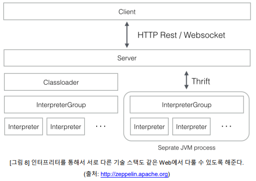
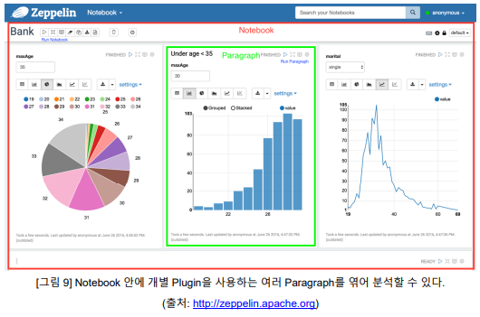
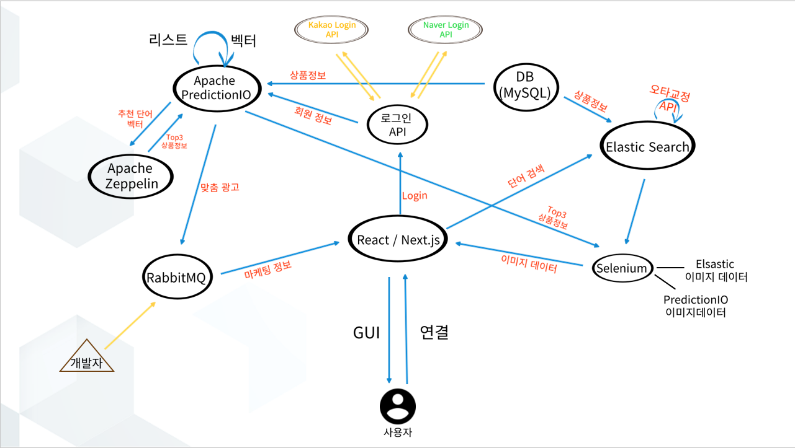

# 오픈소스 시스템 설계서

## < 전자 제품 중고거래 사이트 - 검색 및 추천을 통해 유저에게 제공 >

- 검색 엔진 및 추천 서비스

| 프로젝트 이름  |                                                        |
| -------------- | ------------------------------------------------------ |
| 참여자         | 김택신, 남기철, 민찬혁, 박광수, 최어진, 허서준, 황선하 |
| 날짜           |                                                        |
| Classification | Public                                                 |

## 서비스 소개

## 유사 서비스 분석

## 시스템 설계 내용 요약

- 사용된 오픈소스 목록

  - React, Next.js: GUI 구현을 위한 오픈소스
    - Next.js: 고속 **웹 애플리케이션**을 만들기 위한 구성 요소를 제공하는 React의 프레임워크입니다.
    - React: **대화형** 사용자 **인터페이스**를 구축하기 위한 **JavaScript** 라이브러리입니다.
    - 참고한 깃허브 링크: https://github.com/danawalab/service-management.git
    - 라이선스: [MIT License](https://github.com/vercel/next.js/blob/canary/license.md)
  - MYSQL: DB관리 오픈소스
    - 가장 널리 사용되고 있는 관계형 데이터베이스 관리 시스템(RDBMS: Relational DBMS)
    - 참고한 깃허브 링크: https://github.com/mysql/mysql-server.git
    - 라이선스: (유료)[상용 라이선스](https://github.com/mysql/mysql-server/blob/8.0/LICENSE)
  - < 오타 수정 오픈소스 >
    - 간단한 설명
  - Elasticsearch: 검색 엔진 오픈소스 
    - 상품 정보 검색을 위한 오픈소스입니다. 데이터를 저장, 검색 및 관리가 가능한분산된 RESTful 검색 및 분석 엔집입니다.
    - 참고한 깃허브 링크: https://github.com/elastic/elasticsearch
    - 라이선스:[Elastic License 2.0](https://www.elastic.co/kr/licensing/elastic-license)


  - Apache PredictionIO: 사용자 추천 오픈소스

    - 오픈소스 설명: 개발자와 데이터 과학자가 기계 학습 작업을 위한 예측 엔진을 만들 수 있도록 최신 오픈소스 스택 위에 구축된 **오픈소스 기계 학습 서버입니다.**
    - 깃허브 링크: https://github.com/apache/predictionio.git
    - 라이선스: [Apache License 2.0](https://github.com/apache/predictionio/blob/develop/LICENSE.txt)

  - Apache Zeppelin: 데이터 시각화 오픈소스

    - 오픈소스 설명: Data 프레임워크/애플리케이션들 을 서로 조합하여 한 곳에서 분석코드 작성/실행/시각화/공유를 가능케 해주는 빅데이터 분석 도구입니다
    - 깃허브 링크: https://github.com/apache/zeppelin
    - 라이선스: [Apache License 2.0](https://github.com/apache/zeppelin/blob/master/LICENSE)

  - < 이미지 크롤링 오픈소스 >

    - 간단한 설명

  - RabbitMQ : 채팅 서비스 구현을 위한 오픈소스
    - rabbitMQ는 AMQP를 따르는 오픈소스 메시지 브로커 프로젝트입니다. 메시지 브로커라고 불리며, 메세지를 많은 사용자에게 전달하거나, 요청에 대한 처리 시간이 길 때, 요청을 다른 API에게 위임하고 빠른 응답을 할 때 많이 사용합니다.
    - 깃허브 링크 : https://github.com/rabbitmq
    - 라이선스 : [Apache License 2.0](https://github.com/rabbitmq/osiris/blob/main/LICENSE-APACHE2), [Mozilla Public License 2.0](https://github.com/rabbitmq/osiris/blob/main/LICENSE-MPL-RabbitMQ)

## 사용된 오픈소스에 대한 설명

- ### React, Next.js: GUI 구현을 위한 오픈소스


  - Next.js: 고속 **웹 애플리케이션**을 만들기 위한 구성 요소를 제공하는 React의 프레임워크입니다.

    - 프레임워크: React에 필요한 툴과 구성을 처리하고 애플리케이션에 추가구조, 기능 및 최적화를 제공하는 것을 의미합니다.

  - React: **대화형** 사용자 **인터페이스**를 구축하기 위한 **JavaScript** 라이브러리입니다.

    - 컴포넌트라고 불리는 스니펫을 사용해 복잡한 UI를 구성하도록 돕습니다.
      - 스니펫: 재사용 가능한 소스코드, 기계어, 텍스트의 작은 부분을 의미합니다.

  - 웹 응용프로그램 구성요소

    - Graphic User Interface: 사용자가 응용프로그램을 사용하고 상호작용하는 방법
    - 라우팅: 사용자가 응용 프로그램의 여러 부분을 이동하는 방법
    - 인프라 스트럭쳐: 애플리케이션 코드를 전개, 저장 및 실행
    - 퍼포먼스: 최종 사용자에 맞게 애플리케이션을 최적화하는 방법

  - #### 앱을 만들기 위한 기본 사항

    - React를 사용해 완전한 웹 서비스를 구축하기 위해 필요한 세부사항입니다.
      - 코드는 webpack과 같은 번들러를 사용하여 번들링되고, Babel과 같은 컴파일러를 사용해 변환되어야 합니다.
      - 코드 분할과 같은 생산 최적화를 수행해야 합니다.
      - 성능 및 SEO를 위해 일부 페이지를 정적으로 사전 렌더링할 수 있습니다.서버 측 렌더링이나 클라이언트 측 렌더링을 사용할 수도 있습니다.
      - React 앱을 데이터 저장소에 연결하기 위해 일부 서버측 코드를 작성해야할 수 있습니다.
      - 해당 문제점들은 Framework를 통해 해결할 수 있습니다.
    - React Framework가 제공하는 기능들
      - 페이지 기반 라우팅 시스템
      - 페이지별로 지원되는 사전 렌더링, 정적 생성 및 서버 측 렌더링
      - 자동 코드 분할을 통한 더 빠른 페이지 로드
      - 최적화된 프리페치를 사용한 클라이언트 측 라우팅

  - #### React 사용

    - React를 사용하여 UI를 구축한 후 Next.js 기능을 점진적으로 채택해 웹 응용 프로그램 구성 요소인 라우팅, 데이터 가져오기, 통합 등의 일반적인 애플리케이션 요구사항을 해결하면서 개발자와 최종 사용자 환경을 개선할 수 있습니다.

    - 사용자가 웹 페이지를 방문하면 서버는 사용자에게 HTML 파일을 브라우저에 반환합니다. 그런 다음 브라우저는 HTML 파일을 읽어 DOM을 구성합니다. 이 때 DOM은 코드와 사용자 인터페이스를 연결하는 브리지 역할을 합니다.

    - React: 선언적 UI 라이브러리

      - 개발자가 사용자 인터페이스를 구축하는 데 도움이 되는 선언적 라이브러리로 React가 사용 됩니다.

      - 개발자로서 사용자 인터페이스에 어떤 일을 처리하기를 원하는지 React에게 알릴 수 있고, React는 개발자를 대신해 DOM을 업데이트하는 단계를 알아냅니다.

      - 일반적으로 JavaScript로 DOM을 직접 조작하는 대신 react-dom 라이브러리의 ReactDOM.render() 메서드를 사용하여 제목을 지정할 수 있습니다.

        - 이 때 사용하는 코드는 JS가 아닌 JSX이므로 브라우저가 이해하지 못합니다.
        - 따라서 JSX 코드를 일반 JS로 변환하기 위해서는 Babel과 같은 JavaScript 컴파일러가 필 요합니다.
        - 추가로 스크립트의 type을 text/jsx로 지정합니다.

        ```
        <script src="https://unpkg.com/@babel/standalone/babel.min.js"></script>
        <script type="text/jsx">
        ```

      - React는 사용자를 대신해 작업을 수행하는 재사용 가능한 코드 스니펫을 포함하는 라이브러리입니다.

      - React는 hooks라는 함수 세트를 사용해 구성요소의 상태와 같은 논리를 추가할 수 있습니다. 사용자의 상호작용에 의해 변화하는 UI의 모든 정보라고 할 수 있습니다.

        - ex) React의 hooks의 함수세트 중 useState() 메서드를 사용 사용자가 좋아요 버튼을 클릭한 횟수를 저장하고 증가시킬 수 있습니다.

    - React 동작 방식

      - 유저가 브라우저를 통해 앱에 접속합니다.
      - 앱은 브라우저에게 javascript 정보가 들어있는 빈 HTML 문서를 전달합니다.
      - 브라우저는 javascript 파일을 다운로드하고 동시에 유저는 빈 화면을 봅니다.
      - 브라우저에서 js 파일의 다운로드가 끝나면 리액트 코드가 있는 js 파일을 실행합니다.
      - 브라우저에 있는 리액트 코드가 UI를 렌더링합니다.
      - 유저는 앱이 보여주고자 했던 화면을 보게 됩니다.

    - Next 동작 방식

      - 유저가 브라우저를 통해 앱에 접속합니다.
      - 서버에서 리액트를 실행합니다.
      - 리액트는 UI를 렌더링합니다.
      - 렌더링된 결과를 통해 브라우저에게 HTML을 제공합니다. 이 때 유저는 앱의 초기화면을 보게 됩니다.
      - 이후 브라우저는 리액트 코드가 있는 JS 파일을 다운받고 실행시킵니다.

  - #### 앱 구현

    - React 와 Next.js를 사용해 로그인하기

      - 컴포넌트를 만들어 사용
        - 유저에게 보여질 UI를 담고 있는 디렉터리에서 component 폴더 생성 후 Head.js 파일과 Intro.js 파일을 생성합니다.
        - import를 사용해 생성한 컴포넌트를 가져옵니다.
      - nodemon을 설치한 후 서버에서 실행합니다.
      - SQL 연결

      ```
      $ cd /usr/local/mysql/bin/
      ```

      - 해당 폴더로 이동하여 아래 커멘드 실행

      ```
      $ ./mysql -u root -p
      ```

      - 비밀번호를 입력하여 MySQL 데이터베이스에 접속합니다.

    - 데이터베이스, 테이블, 데이터 생성

      - 데이터베이스를 생성한 후 데이터 베이스를 선택합니다.
      - 이후 테이블을 만들 수 있습니다.

    - Node.js에 SQL 모듈 설치 및 설정

      - server 폴더에 sql 모듈을 설치하고 불러옵니다.
      - dataBase 변수를 생성하여 연결 정보를 입력합니다.

    - 데이터 넣고 가져오기

      - 데이터 넣기
      - 넣은 데이터 확인하기
      - 데이터베이스의 값들 가져오기
      - 사용자 폴더에서 가져오기
      - 서버에서 3001 포트 보낸 것을 리액트로 가져온다.

- ### MYSQL: DB관리 오픈소스


  - 가장 널리 사용되고 있는 관계형 데이터베이스 관리 시스템(RDBMS: Relational DBMS)
   - 관계형 데이터베이스: 관계형 데이터베이스는 데이터가 하나 이상의 열과 행의 테이블(또는 '관계')에 저장되어 서로 다른 데이터 구조가 어떻게 관련되어 있는지 쉽게 파악하고 이해할 수 있도록 사전 정의된 관계로 데이터를 구성하는 정보 모음
  
  - 여러 프로그래밍 언어와 호환성이 좋음

  - 라이선스: 상용 소프트웨어(유료), GPL v2(무료)
   - 유료 상용라이선스를 쓰는 이유
    - Apachi 2.0과 GPL v2는 라이선스 충돌을 일으키기 때문에 유료버전을 이용해 라이선스 충돌을 피해야 함.
    - 유료 라이선스를 사용하면 백업/복구, 모니터링 등 자체적인 부가기능과 기술지원을 받을 수 있음 
  
  - mysql을 사용하는 이유
    - https://db-engines.com/en/ranking 이 웹사이트는 DBMS 점유율 순위를 알려주는데 mysql은 다른 DBMS들과 큰 차이로 2위를 하고 있음.

    - mysql이 90년대 등장 이래 많은 곳에서 쓰이는 RDBMS이므로 레퍼런스의 수가 다른 DBMS에 비해 많아 사용하기 유용함.
  
  - ### mysql 기초 개념
    - 테이블(Table): 데이터를 기록하는 최종적인 곳
    - 스키마(Schema): 테이블들을 모아 놓은 것
    - 데이터베이스(Database): 마찬가지로 테이블들을 모아 놓은 것
    - 데이터베이스 서버(Database Server): 스키마들을 모아 놓은 곳
    - 관계형 데이터베이스(Relational Database): 키(key)와 값(value)들의 간단한 관계를 테이블화시킨 데이터베이스
    - SQL(Structured Query Language): 관계형 데이터베이스 관리 시스템의 데이터를 관리하기 위해 설계된 특수 목적의 프로그래밍 언어
    - 쿼리(Query): 데이터베이스에 정보를 요청하는 것. 질의라고도 함
        - 쿼리형식: CRUD(Create Read Update Delete)
            - Create: 표에 데이터 생성
            - Read: 표의 데이터 읽기
            - Update: 새로운 데이터를 표에 업데이트
            - Delete: 표의 데이터를 삭제
    
    - 데이터베이스 명령어
        
        **DDL**
        
        DDL (Data Definition Language, **데이터 정의어)** 데이터의 구조를 정의하는 데 사용하는 명령어 (생성, 변경, 삭제, 이름변경)등을 하기 위한 명령어
        
        - Create - 테이블을 생성한다.
        - Alter - 테이블을 수정한다.
        - Drop - 테이블을 삭제한다.
        - Rename - 테이블의 이름을 변경한다.
        - Truncate - 테이블 안에 있는 데이터를 전체 삭제한다. (Drop과 다르게 테이블은 유지한다.)
        
        **DML**
        
        DML (Data Manipulation Language, **데이터 조작어)** DB안에 있는 데이터를 조회하거나 데이터에 변형을 할 수 있는 명령어
        
        - Select - 데이터를 검색한다.
        - Insert - 데이터를 생성한다.
        - Update - 데이터를 수정한다.
        - Delete - 데이터를 지운다.
        
        DDL과 DCL은 테이블에서 다루는 것과 데이터를 다루는 것에 차이점이 있음.
        
        **DCL**
        
        DCL (Data Control Language, **데이터 제어어)** DB에 접근하고 객체들을 사용할 수 있도록 하는 권한을 주고 회수하는 명령어
        
        - Grant - 권한을 부여한다.
        - Revoke - 권한을 회수한다.
        
        **TCL**
        
        TCL (Transaction Control Language, **트랜젝션 제어어)** 트랜젝션이란 작업의 제어 단위. 데이터베이스가 많은 작업, 동시 작업을 하게 되는 경우 제어가 필요
        
        - Commit - 변경된 데이터를 테이블에 영구적으로 반영한다.
        - Rollback - 데이터 변경을 취소하여 데이터를 이전 상태로 복구한다.
        - Savepoint - 롤백은 이전의 데이터 변경을 취소한다면 savepoint는 저장 위치를 정의한 곳까지 돌아간다.
  
  - ### 시스템에서의 사용
    - 사용자에게 판매할 컴퓨터 장비들을 DB에 저장하고 이 정보를 가져와 사용할 것임
    - <판매할 컴퓨터 장비들을 저장한 DB 모습>
        
        
        | 이름    | 가격    | 제조일자  |
        | ---     | ---    | ---       |
        | RTX3060 | 450000 | 210405    |
        | i5-12400| 220000 | 211013    |

    - 설치
      - https://www.mysql.com/downloads/ MYSQL설치 주소

    - 접속
      ```
      mysql -uroot -p
      ```
      나의 mysql 계정으로 접속한다.
      ```
      SHOW DATABASES;
      ```
      생성된 데이터베이스를 확인할 수 있다.
      ```
      use 데이터베이스이름;
      ```
      해당 데이터베이스에 접속한다.
      ```
      SHOW TABLES;
      ```
      테이블의 목록을 확인할 수 있다.

    - 데이터베이스 생성하기
      1. root 계정 접속 후
      2. 명령어 입력`CREATE DATABASE 데이터베이스이름 default CHARACTER SET UTF8;`
    
      products_db 라는 데이터베이스를 생성하기`CREATE DATABASE products_db default CHARACTER SET UTF8;`

    - 테이블 생성하기
      1. todo_user 계정으로 접속`mysql -utodo_user -p`
    
      2. 데이터베이스 목록보기`show databases;`
    
      ```
      +--------------------+
      | Database           |
      +--------------------+
      | information_schema |
      | products_db        |
      +--------------------+
      ```
    
      3. products_db라는 데이터베이스의 table 확인하기
    
      ```
      mysql> use todo_db;
      Database changed
      mysql> show tables;
      Empty set (0.01 sec)
      ```
    
      4. table 추가하기
    
      ```
      CREATE TABLE 테이블이름 (
    	  컬럼명 데이터타입 ... ,
       	  컬럼명 데이터타입 ... ,
        	  ...
              );
      ```
    
    - products 라는 테이블 생성하기
    
      ```
      CREATE TABLE products (
          id BIGINT(20) UNSIGNED NOT NULL AUTO_INCREMENT,
          title VARCHAR(255) NOT NULL,
          price INT(8) NOT NULL,
          regdate DATETIME DEFAULT NOW(),
          PRIMARY KEY (id)
          );
    
      ```
    
      1. "id" 컬럼 생성
          - 데이터타입 : BIGINT(20) UNSIGNED
          - 제약조건 : NOT NULL (null값을 가질 수 없음)
          - AUTO_INCREMENT : 1부터 자동으로 증가
      2. "name" 컬럼 생성
          - 데이터타입 : VARCHAR(100)
          - 제약조건 : NOT NULL
      3. "price" 컬럼 생성
          - 데이터타입 : INT(8)
          - 제약조건 : NOT NULL
      4. "regdate" 컬럼 생성
          - 데이터타입 :DATETIME(문자열 형식이며 YYYY-MM-DD HH:MM:SS 형식)
          - default : now() 라는 내장함수 사용
      5. 기본키는 "id"
      
  - 테이블 데이터 추가
    
    ```sql
    INSERT into 테이블이름 (컬럼1, 컬럼2, ...) values (컬럼1에 넣을 데이터, 컬럼2에 넣을 데이터 ...);
    ```
        

  - 가장 널리 사용되고 있는 관계형 데이터베이스 관리 시스템(RDBMS: Relational DBMS)
   - 관계형 데이터베이스: 관계형 데이터베이스는 데이터가 하나 이상의 열과 행의 테이블(또는 '관계')에 저장되어 서로 다른 데이터 구조가 어떻게 관련되어 있는지 쉽게 파악하고 이해할 수 있도록 사전 정의된 관계로 데이터를 구성하는 정보 모음
  
  - 여러 프로그래밍 언어와 호환성이 좋음

  - 라이선스: 상용 소프트웨어(유료), GPL v2(무료)
   - 유료 상용라이선스를 쓰는 이유
    - Apachi 2.0과 GPL v2는 라이선스 충돌을 일으키기 때문에 유료버전을 이용해 라이선스 충돌을 피해야 함.
    - 유료 라이선스를 사용하면 백업/복구, 모니터링 등 자체적인 부가기능과 기술지원을 받을 수 있음 
  
  - mysql을 사용하는 이유
    - https://db-engines.com/en/ranking 이 웹사이트는 DBMS 점유율 순위를 알려주는데 mysql은 다른 DBMS들과 큰 차이로 2위를 하고 있음.

    - mysql이 90년대 등장 이래 많은 곳에서 쓰이는 RDBMS이므로 레퍼런스의 수가 다른 DBMS에 비해 많아 사용하기 유용함.
  
  - ### mysql 기초 개념
    - 테이블(Table): 데이터를 기록하는 최종적인 곳
    - 스키마(Schema): 테이블들을 모아 놓은 것
    - 데이터베이스(Database): 마찬가지로 테이블들을 모아 놓은 것
    - 데이터베이스 서버(Database Server): 스키마들을 모아 놓은 곳
    - 관계형 데이터베이스(Relational Database): 키(key)와 값(value)들의 간단한 관계를 테이블화시킨 데이터베이스
    - SQL(Structured Query Language): 관계형 데이터베이스 관리 시스템의 데이터를 관리하기 위해 설계된 특수 목적의 프로그래밍 언어
    - 쿼리(Query): 데이터베이스에 정보를 요청하는 것. 질의라고도 함
        - 쿼리형식: CRUD(Create Read Update Delete)
            - Create: 표에 데이터 생성
            - Read: 표의 데이터 읽기
            - Update: 새로운 데이터를 표에 업데이트
            - Delete: 표의 데이터를 삭제
    
    - 데이터베이스 명령어
        
        **DDL**
        
        DDL (Data Definition Language, **데이터 정의어)** 데이터의 구조를 정의하는 데 사용하는 명령어 (생성, 변경, 삭제, 이름변경)등을 하기 위한 명령어
        
        - Create - 테이블을 생성한다.
        - Alter - 테이블을 수정한다.
        - Drop - 테이블을 삭제한다.
        - Rename - 테이블의 이름을 변경한다.
        - Truncate - 테이블 안에 있는 데이터를 전체 삭제한다. (Drop과 다르게 테이블은 유지한다.)
        
        **DML**
        
        DML (Data Manipulation Language, **데이터 조작어)** DB안에 있는 데이터를 조회하거나 데이터에 변형을 할 수 있는 명령어
        
        - Select - 데이터를 검색한다.
        - Insert - 데이터를 생성한다.
        - Update - 데이터를 수정한다.
        - Delete - 데이터를 지운다.
        
        DDL과 DCL은 테이블에서 다루는 것과 데이터를 다루는 것에 차이점이 있음.
        
        **DCL**
        
        DCL (Data Control Language, **데이터 제어어)** DB에 접근하고 객체들을 사용할 수 있도록 하는 권한을 주고 회수하는 명령어
        
        - Grant - 권한을 부여한다.
        - Revoke - 권한을 회수한다.
        
        **TCL**
        
        TCL (Transaction Control Language, **트랜젝션 제어어)** 트랜젝션이란 작업의 제어 단위. 데이터베이스가 많은 작업, 동시 작업을 하게 되는 경우 제어가 필요
        
        - Commit - 변경된 데이터를 테이블에 영구적으로 반영한다.
        - Rollback - 데이터 변경을 취소하여 데이터를 이전 상태로 복구한다.
        - Savepoint - 롤백은 이전의 데이터 변경을 취소한다면 savepoint는 저장 위치를 정의한 곳까지 돌아간다.
  
  - ### 시스템에서의 사용
    - 사용자에게 판매할 컴퓨터 장비들을 DB에 저장하고 이 정보를 가져와 사용할 것임
    - <판매할 컴퓨터 장비들을 저장한 DB 모습>
        
        
        | 이름    | 가격    | 제조일자  |
        | ---     | ---    | ---       |
        | RTX3060 | 450000 | 210405    |
        | i5-12400| 220000 | 211013    |

    - 설치
      - https://www.mysql.com/downloads/ MYSQL설치 주소

    - 접속
      ```
      mysql -uroot -p
      ```
      나의 mysql 계정으로 접속한다.
      ```
      SHOW DATABASES;
      ```
      생성된 데이터베이스를 확인할 수 있다.
      ```
      use 데이터베이스이름;
      ```
      해당 데이터베이스에 접속한다.
      ```
      SHOW TABLES;
      ```
      테이블의 목록을 확인할 수 있다.

    - 데이터베이스 생성하기
      1. root 계정 접속 후
      2. 명령어 입력`CREATE DATABASE 데이터베이스이름 default CHARACTER SET UTF8;`
    
      products_db 라는 데이터베이스를 생성하기`CREATE DATABASE products_db default CHARACTER SET UTF8;`

    - 테이블 생성하기
      1. todo_user 계정으로 접속`mysql -utodo_user -p`
    
      2. 데이터베이스 목록보기`show databases;`
    
      ```
      +--------------------+
      | Database           |
      +--------------------+
      | information_schema |
      | products_db        |
      +--------------------+
      ```
    
      3. products_db라는 데이터베이스의 table 확인하기
    
      ```
      mysql> use todo_db;
      Database changed
      mysql> show tables;
      Empty set (0.01 sec)
      ```
    
      4. table 추가하기
    
      ```
      CREATE TABLE 테이블이름 (
    	  컬럼명 데이터타입 ... ,
       	  컬럼명 데이터타입 ... ,
        	  ...
              );
      ```
    
    - products 라는 테이블 생성하기
    
      ```
      CREATE TABLE products (
          id BIGINT(20) UNSIGNED NOT NULL AUTO_INCREMENT,
          title VARCHAR(255) NOT NULL,
          price INT(8) NOT NULL,
          regdate DATETIME DEFAULT NOW(),
          PRIMARY KEY (id)
          );
    
      ```
    
      1. "id" 컬럼 생성
          - 데이터타입 : BIGINT(20) UNSIGNED
          - 제약조건 : NOT NULL (null값을 가질 수 없음)
          - AUTO_INCREMENT : 1부터 자동으로 증가
      2. "name" 컬럼 생성
          - 데이터타입 : VARCHAR(100)
          - 제약조건 : NOT NULL
      3. "price" 컬럼 생성
          - 데이터타입 : INT(8)
          - 제약조건 : NOT NULL
      4. "regdate" 컬럼 생성
          - 데이터타입 :DATETIME(문자열 형식이며 YYYY-MM-DD HH:MM:SS 형식)
          - default : now() 라는 내장함수 사용
      5. 기본키는 "id"
      
  - 테이블 데이터 추가
    
    ```sql
    INSERT into 테이블이름 (컬럼1, 컬럼2, ...) values (컬럼1에 넣을 데이터, 컬럼2에 넣을 데이터 ...);
    ```
        

- ### Elasticsearch: 검색 엔진 오픈소스 
  - 상품 정보 검색을 위한 오픈소스입니다. 데이터를 저장, 검색 및 관리가 가능한분산된 RESTful 검색 및 분석 엔집입니다.
  - #### 다음과 같은 정보들을 저장,검색, 관리 할 수 있습니다.
    - 로그
    - 메트릭스
    - 검색 백엔드
    - 어플레케이션 모니터링
    - 엔드포인트 보안
  - #### 시작하는 법
    - 엘라스틱서치 설정하는 가장 간단한 방법은 엘라스틱 클라우드에서 엘라스틱 서치서비스를 사용하여 중앙 관리 배포를 생성하는 것입니다.
    - 엘라스틱서치를 직접 설치하고 관리하려는 경우 elastic.co/downloads/elasticsearch에서 최신 버전을 다운로드할 수 있습니다.
    
    -**로컬에서 엘라스틱 서치를 실행하는법**
    
    - 자신의 컴퓨터에서 엘라스틱서치를 사용할려면 Docker을 사용하는 것이 좋습니다. 엘라스틱서치와 kibana를 모두 실행할 수 있습니다. 도커 이미지는 Elastic Docker registry에서 이용 가능합니다
    - **엘라스틱 서치 시작하는법**
      - 1.Docker Desktop을 설치하고 시작합니다. 기본 설정 > 리소스 > 고급으로 이동하여 메모리를 4GB 이상으로 설정합니다.
      - 2.엘라스틱서치 컨테이너를 시작합니다.
      ```
      docker network create elastic
      docker pull docker.elastic.co/elasticsearch/elasticsearch:{version} (1)
      docker run --name elasticsearch --net elastic -p 9200:9200 -p 9300:9300 -e "discovery.type=single-node" -t docker.elastic.co/elasticsearch/elasticsearch:{version}
      ```
      - 1.{version}을 실행하려는 엘라스틱서치의 버전으로 바꿉니다.
    - 엘라스틱서치를 처음 시작하면 생성된 엘라스틱 사용자 비밀번호와 Kibana 등록 토큰이 터미널에 출력됩니다.
    - 3. 생성된 암호 및 등록 토큰을 복사하여 안전한 위치에 저장합니다. 이러한 값은 엘라스틱서치를 처음 시작할 때만 표시됩니다. 이것을 사용하여 엘라스틱서치 클러스터에 Kibana를 등록하고 로그인합니다.
  - **kibana 시작하는법**
    - Kibana를 사용하면 Elastic 검색에 쉽게 요청을 보내고 대화식으로 데이터를 분석, 시각화 및 관리할 수 있습니다.
      - 1.새 터미널 세션에서 Kibana를 시작하고 엘라스틱서치 컨테이너에 연결합니다.
      ```
      docker pull docker.elastic.co/kibana/kibana:{version} (1)
      docker run --name kibana --net elastic -p 5601:5601 docker.elastic.co/kibana/kibana:{version}
      ```
        - 1.버전을 실행하려는 kibana버전으로 바꿉니다.
      - kibana를 시작하면 고유한 URL터미널에 출력됩니다.
    - 2.kibana에 엑세스하려면 브라우저에서 생성된 URL을 엽니다.
      - A.엘라스틱서치를 시작할 때 복사한 등록 토큰을 붙여넣고 버튼을 클릭하여 Kibana 인스턴스를 엘라스틱서치와 연결합니다.
      - B.엘라스틱서치를 시작할 때 생성된 암호로 Kibana에 Elastic 사용자로 로그인합니다.
      
    - **테이터 추가하기**
      - REST API를 통해 JSON 개체(문서)를 전송하여 Elast search에 데이터를 인덱싱합니다. 텍스트, 숫자 데이터 또는 지리공간 데이터가 정형이든 비정형이든 관계없이 Elastic search는 빠른 검색을 지원하는 방식으로 효율적으로 저장하고 인덱싱합니다.
      
      - 로그 및 메트릭과 같은 타임스탬프가 지정된 데이터의 경우 일반적으로 여러 개의 자동 생성 백업 인덱스로 구성된 데이터 스트림에 문서를 추가합니다.
      
      - 색인에 단일 문서를 추가하려면 색인을 대상으로 하는 HTTP 게시 요청을 제출하십시오.
      ```
      POST /customer/_doc/1
      {
      "firstname": "Jennifer",
      "lastname": "Walters"
      }
      ```
      - 이 요청은 ```고객``` 색인이 없는 경우 자동으로 작성되고 ID가 1인 새 문서를 추가하며 ```이름``` 및 ```성``` 필드를 저장하고 색인화합니다.
      - 새 문서는 클러스터의 모든 노드에서 즉시 사용할 수 있습니다. 문서 ID를 지정하는 GET 요청으로 검색할 수 있습니다.
      ```
      GET /customer/_doc/1
      ```
      - 하나의 요청에 여러 문서를 추가하려면 ```_bulk``` API를 사용하십시오. 대량 데이터는 줄바꿈으로 구분된 JSON(NDJSON)이어야 합니다. 각 줄은 마지막 줄을 포함하여 새 줄 문자(```\n```)로 끝나야 합니다.
      ```
      PUT customer/_bulk
      { "create": { } }
      { "firstname": "Monica","lastname":"Rambeau"}
      { "create": { } }
      { "firstname": "Carol","lastname":"Danvers"}
      { "create": { } }
      { "firstname": "Wanda","lastname":"Maximoff"}
      { "create": { } }
      { "firstname": "Jennifer","lastname":"Takeda"}
      ```
    - **검색하기**
      - 인덱스화된 문서는 거의 실시간으로 검색할 수 있습니다. 다음 검색은 ```고객``` 인덱스에서 제니퍼라는 이름을 가진 모든 고객과 일치합니다.

- ### Apache PredictionIO: 사용자 추천 오픈소스

  - 개발자와 데이터 과학자가 기계 학습 작업을 위한 예측 엔진을 만들 수 있도록 최신 오픈소스 스택 위에 구축된 **오픈소스 기계 학습 서버입니다.**

  - #### PredictionIO로 수행 가능한 목록

    - Customizable templates를 사용해 프로덕션 환경에서 엔진을 웹 서비스로 신속하게 구축하고 배포할 수 있습니다.
      - Customizable templates(엔진 템플릿 다운로드가 필요)
        - Universal 추천기: 전자 상거래, 뉴스, 비디오, 사용자 행동 데이터가 알려진 모든 곳에서 권장 사항을 요구하는 거의 모든 경우
        - **추천**: 저희 서비스가 사용할 엔진 템플릿입니다. 해당 템플릿에는 기본적으로 Apache Spark MLlib의 협업 필터링 알고리즘이 통합되어 있습니다. 특정 요구사항에 맞게 쉽게 사용자 정의가 가능합니다.
        - 전자상거래 추천
        - 유사한 제품 추천
    - 웹 서비스로 배포 시에 동적 Query에 **실시간으로 응답합니다.**
      - Query: 데이터베이스에게 특정 데이터를 보여달라는 클라이언트(사용자)의 요구
    - 여러 엔진의 변형을 체계적으로 평가하고 조정합니다.
      - 엔진: 예측을 담당하는 기관으로, 훈련 데이터를 읽고 예측 모델 구축 후 웹 서비스로 배포합니다.
    - 포괄적인 예측 분석을 위해 여러 플랫폼의 데이터를 일괄 혹은 실시간으로 통합합니다.
    - 자체 기계학습 모델을 구현하고 이를 엔진에 원활하게 통합합니다.
    - 체계적인 프로세스와 사전 구축된 평가 조치를 통해 머신러닝 모델링 속도를 향상합니다.

  - #### 구성

    - PredictionIO 플랫폼: 머신러닝 알고리즘으로 엔진 구축, 엔진에 대한 평가와 구축된 엔진을 배포하기 위한 머신러닝 스택입니다.

    - 이벤트 서버: 여러 플랫폼의 이벤트를 통합하기 위한 오픈소스 머신러닝 분석 계층입니다. 어플리케이션에서 지속적으로 데이터를 수집합니다.

    - 템플릿 갤러리: 다양한 유형의 기계학습 어플리케이션에 대한 엔진 템플릿을 다운로드할 수 있습니다.

    - 엔진 배포 방법

      1. PredictionIO 설치 및 실행

      2. 엔진 템플릿을 다운로드하여 엔진 생성

         - 템플릿 갤러리로 이동하여 엔진 템플릿을 선택하고 해당 이름을 클릭
         - 클릭 시, GitHub 리포지토리로 리다이렉션됩니다.
         - 엔진을 로컬 컴퓨터에 Clone하여 추가로 사용 지정합니다.

      3. PredictionIO를 새 어플리케이션과 통합하는 경우, 앱 ID 및 액세스 키 생성

      4. 데이터 수집

      5. 엔진을 서비스로 배포: 해당 단계에서 엔진은 **충분한 훈련**이 되어 있어야 합니다.

         1. `pio app new **어플이름**`을 실행하고 다운받은 템플릿의 engine.json파일 안에 `appName`을 지정합니다. (여기에서 원하는대로 설정 가능)
         2. `pio build`를 실행하여 엔진을 업데이트합니다.
         3. 교육 데이터로 예측 모델을 교육하기 위해 `pio train`을 실행합니다.
         4. `pio deploy`를 실행해 엔진을 서비스로 배포합니다.

         - 배포된 엔진은 기본적으로 포트 번호 8000을 수신합니다.
         - 어플리케이션은 REST 인터페이스를 통해 실시간으로 예측을 검색하는 쿼리를 보냅니다.

      6. 엔진 사용

  - #### 설치와 시스템 아키텍처 및 종속성

    - 템플릿은 일반적으로 백그라운드의 주기적인 모델 업데이트와 실시간 제공을 통합하기 위한 Lambda 모델에 적합합니다.

    - PredictionIO를 지원하는 기술이 최소버전을 충족하고 있는지 확인이 **반드시 필요**합니다.

    - 이벤트 서버 데이터 저장소: Apache HBase -> 가져온 이벤트 저장

      - Apache Hadoop 2.6.5(선택사항)
      - Haoop 2.6용 Apache Spark 2.0.2: 데이터 준비 및 알고맂즘에 대한 입력, 훈련, 서빙처리를 지원하는 데이터 처리 엔진
        - HDFS: 분산 파일 시스템입니다. 클러스터된 시스템 간에 저장소를 공유할 수 있습니다. 데이터 일괄 가져오기, 이벤트 서버 데이터 세트 내보내기 및 일부 모델 저장을 위해 데이터를 준비하는 데에 사용합니다.
      - 자바 Se 개발 키트 8
      - **MySQL 5.1**
      - **Elastic Search 1.7.6**: 모델 버전, 엔진 버전, 액세스 키 및 앱 ID 매핑, 평가 결과 등과 같은 메타데이터를 저장합니다. 일부 템플릿의 경우 모델을 저장할 수 있습니다.

      학습 결과는 모델과 해당 메타데이터의 두 부분으로 구성됩니다. 그런 다음 모델은 HDFS와 로컬 파일 시스템 혹은 Elasticsearch에 저장됩니다.

  - #### 앱 통합

    - 프로덕션 환경의 애플리케이션과 통합되는 기계 학습 서버로 설계되었습니다.

      1. 모델 교육을 위해 Apache PredictionIO의 이벤트 서버로 이벤트 데이터를 보냅니다.
      2. 배포된 엔진에 동적 쿼리를 보내 예측 결과를 검색합니다.

    - 이벤트 데이터 보내기

      - 이벤트 서버는 어플리케이션에서 이벤트 데이터를 수신합니다. 이 데이터는 엔진에서 예측 모델을 구축하기 위한 학습 데이터로 사용이 가능합니다.

      - 이벤트 서버는 기본적으로 포트 번호로 7070을 사용하지만 이벤트 서버를 시작할 때 ` --port`인수로 포트를 변경할 수 있습니다.

      - 이벤트 서버

        - RESTful API를 통해 이벤트 기반 스타일로 데이터를 수집하는 이벤트 서버를 제공합니다.

        - 기본적으로 Event Server는 Apache HBase를 데이터 저장소로 사용합니다.

        - 예시) 상품 추천을 위해 수집할 이벤트 예시

          - 사용자 1이 구매한 제품 X
          - 사용자 2가 조회한 제품 Y
          - 사용자 1이 장바구니에 추가한 제품 Z

          이 때, 사용자 Property는 성별, 나이, 위치 등일 수 있습니다.

          제품 Property는 장르, 작성자 및 사용자의 선호도와 관련될 수 있습니다.

    - 쿼리 보내기

      - 엔진을 웹 서비스로 배포하면 어플리케이션의 쿼리를 기다리고 예상 결과를 **JSON**형식으로 반환합니다. 엔진은 기본적으로 포트 8000을 수신합니다.

  - #### 파이썬 SDK

    - 설치

      - PyPI에서 모듈 설치

      ```
      $ pip install predictionio
      혹은
      $ easy_install predictionio
      ```

      - 리포지토리를 Clone한 뒤 직접 설치 - Python 환경에 predictionio 모듈 설치

      ```
      $ python setup.py install
      ```

      - 파이썬 스크립트에서 PredictionIO를 사용

      ```py
      >>> import prediction
      ```

  - #### 추천

    - 이벤트 데이터 요구사항: 기본적으로 템플릿에서는 사용자가 평가한 항목 이벤트와 사용자가 구매한 항목 이벤트가 필요합니다.
    - 입력 쿼리: 사용자 아이디와 추천할 아이템의 수
    - 출력 예측 결과: 권장 항목 ID의 순위 목록

    1. MySQL을 사용하는 경우 `$ pio eventserver &`을 실행해 이벤트 서버를 실행합니다.

       - 정상 실행된 경우 다음 코드 블럭이 실행됩니다.

         ```
         ...

         (sleeping 5 seconds for all messages to show up...)
         Your system is all ready to go.
         ```

    2. 엔진 템플릿에서 사용할 엔진을 디렉터리로 clone하여 다음 명령을 실행합니다.

       ```
       $ 자식 클론 https://github.com/apache/predictionio-template-recommender.git MyRecommendation
       $ cd MyRecommendation
       ```

    3. 앱 ID 및 액세스 키를 생성합니다.

    4. 데이터를 수집합니다.

       - 데이터 인풋으로 지정한 평가 및 구매 항목에 대한 이벤트를 이벤트 서버에 실시간으로 쉽게 보낼 수 있습니다.

         ```
         $ curl -i -X GET " http://localhost:7070/events.json?accessKey= $ACCESS_KEY "
         ```

       - 이 때 가져오는 이벤트는 JSON 파일로 변환합니다.

       - 해당 메서드는 PredictionIO의 함수로서 지정되어 있습니다.

    5. 엔진을 서비스로 배포합니다.

- ### < 데이터 시각화 오픈소스>

  -Data 프레임워크/애플리케이션들 을 서로 조합하여 한 곳에서 분석코드 작성/실행/시각화/공유를 가능케 해주는 빅데이터 분석 도구입니다

  - #### Zeppelin 과 데이터 분석 도구 생태계

    - Zeppelin은 비교적 최근에 등장한 분석 도구로서 아파치 소프트웨어 재단의 후원을 받으며 개발이 되고 있습니다.
    - 사용자들은 Zeppelin을 이용하여 Web에서 Python, Scala 등의 다양한 언어를 섞어가며 분석 코드를 짤 수 있고 이 결과를 바로 Graph로 시각화하여 볼 수 있습니다.
    - 여기에 더해 Zeppelin은 넓어져 가는 빅데이터 분석 도구 시장의 다양한 니즈에 맞추기 위해서 Spark뿐만이 아닌 Livy, Cassandra, Lens, SQL 등등의 다른 데이터 분석 도구나 데이터베이스에 접근하여 쿼리하는 것을 쉽게 할 수 있는 확장 기능들을 지원한다.
    - 오픈소스를 기반으로 빅데이터 분석 시스템을 구성하는 기업들은 다양한 기술 스택을 서로 엮어서 시스템을 구성하게 되는데 Zeppelin 하나만 있으면 이들 시스템의 각 요소에 자유롭게 접근하여 데이터를 다룰 수 있게 된 것이다.
    - 확장성 때문에 후발주자임에도 매우 빠르게 여러 기업에서 사용되기 시작했고 널리 알려지게 된 것 이다.

  - #### Zeppelin 의 구조
    
      - 위 사진과 같은 확장성은 Zeppelin이 Interpreter라는 플러그인 구조로 지원되는데 각 Interpreter는 Zeppelin의 Web Interface를 통해서 입력받은 분석 코드를 local 또는 원격에서 실행할 수 있다. 
      - 예를 들어 Spark로 Map-Reduce하는 코드를 작성하고 실행을 누르면 Zeppelin 안에 설치된 Spark Interpreter가 이를 받아 Spark Master에 Client 라이브러리를 통해 코드를 보내고 그 실행 결과를 받아 다시 Web Interface에 보내준다. 또한 Bash로 쉘 스크립트를 짜면 Zeppelin 안에 탑재된 Shell Interpreter가 이를 받아 Zeppelin이 설치된 서버에서 shell script를 실행하고 그 결과를 Web Interface에 보내주는 형태이다. 
      - Zeppelin 자체가 데이터 분석 처리를 하지 않기 때문에 분석 시스템이나 데이터베이스 등이 미리 구성되어 있어야 하고, Zeppelin과 이들 시스템을 연결해주는 작업을 해야 한다는 어려움이 있지만 한번 연결해 두면 같은 Notebook에서 Pyspark와 SparkR을 쓰거나 Cassandra DB 등의 데이터베이스까지 다루는 일을 Zeppelin 내에서 편하게 할 수 있는 장점이 있다.
  - #### Zeppelin 기능
    - ##### 분석코드 작성 / 실행 / 시각화
    
    - Hadoop과 Spark는 데이터를 불러들이고, 가공 및 변환하고 분석 알고리즘을돌리는 과정을 코드로 작성해야 한다.
    - 결과를 여러 가지의 Graph를 통해서 시각적으로보여주는 일 또한 해야 하는데 Zeppelin에선 이러한 작업을 단일 Notebook 안에서 할 수 있다. 그것도 자신이 선호하는 Framework 또는 언어를 선택할 수 있다.
    - 결과를 %sql로 정리한 후에Paragraph의 우측 상단의 버튼을 클릭하여 결과를 막대/선/파이 차트 등으로 확인할 수 있다. 주의할점은 Paragraph는 위에서 아래로, 좌에서 우로 실행되므로 이 부분만 주의한다면 다양한 기술 스택들을 서로 엮어 분석코드를 만들 수 있다.
  - ##### Zeppelin의 강력한 장점
    - 협업: Google Apps를 보면 여러 사람이 같이 동시에 Google Sheet나 Google Document 등을 편집할 수 있는데 Zeppelin도 WebSocket을 활용하여 같은 Notebook을 여러 사람이 동시에 편집할 수 있는 기능을 제공하고있다. 한 사람이 분석 코드를 짜면 다른 사람이 그 결과를 원격에서 실시간으로 바로 확인할 수 있다.
    - 확장성: 확장성은 Interpreter라는 플러그인 구조로 지원합니다. 각 Interpreter들은 Zeppelin의 Web Interface를 통해서 입력받은 분석 코드를 local 또는 원격에서 실행 가능합니다.
  - ##### 데이터 바인딩
    - Zeppelin은 Angular JS를 활용하여 Web Interface가 만들어졌기 때문에 Angular JS의장점인 Data Binding 기능을 응용한 보고서 또는 Dashboard를 만들 수 있다. 예를 들어 학교에서 학생들의 성적을 분석하는 보고서를 만들 때 이 보고서에는 50점 이상 학생들의 분포만 보여주는 그래프가 포함되어 있고 이 그래프를 만든 이는 코드를 고쳐 50점을 60점으로 수정한 그래프를 쉽게 만들 수 있을 것이다. 하지만 보고서를 보는 사람이 코드를 잘 모르는데 40점이나 70점 등으로 이리저리 확인해서 보고 싶다면?Zeppelin에선 이 기준점수를 TextBox로 받을 수 있도록 Binding을 걸 수 있다. 이렇게 하면 코드를 모르는 사람도 보고서에서 점수만 고치면 그래프가 자동으로 변경된 값을 반영하여 새로 그려지므로 좀 더 사용자 친화적으로 보고서가 만들어진다. Binding뿐만 아니라,Angular 인터프리터를 사용하여 AngularJS가 가미된 HTML코드를 실행하면 Zeppelin 소스를 수정하지 않아도 여러 GUI를 만들어 낼 수 있어 다양한 Dashboard를 구성할 수 있다.
  - #### 공유
    - IPython등은 데이터 분석/연구 결과를 정리해서 보여주기 위한 연구 노트 같은 기능제공에 초점이 맞춰져 있지만, Zeppelin은 초기부터 분석 결과를 Dashboard 형태로 여러 사람이 공유할 수 있게 하도록 하는 데 초점이 맞춰져 있다. Paragraph 우측 상단에 Export/Share 버튼을 사용하면 그 Paragraph를 IFrame을 이용하여 다른 Website에 Embedded 시켜줄 수 있다. 또한, %html, %md (markdown)등의 자바스크립트 삽입 및 문서 스타일링도 지원하기 때문에 자신의 입맛에 맞게 버튼을 달거나 분석 결과를 다른 모양으로 표현하는 것도 가능하다. 이런 기본 기능들이 맘에 안 든다면 새로운 플러그인을 작성하거나 D3.js를 건드려서 나에게 맞는 형태로 수정해줄 수도 있다. 물론 다소 빌드가 까다롭기 때문에 이 부분은 현재는 쉽진 않지만, 현재 시험적용 중인 Helium Application 기능이 안정화 되면좀 더 확장성이 좋아질 것이라 기대한다.
  -

- ### < 이미지 크롤링 오픈소스 >

  - 설명:

- ### RabbitMQ : AMQP를 따르는 오픈소스 메시지 브로커 시스템

  - RabbitMQ는 Erlang으로 AMQP를 구현한 메시지 브로커 시스템입니다.
    -Erlang : 동시성 및 분산 스스템을 개발하는 데 주로 사용되는 다목적 프로그래밍 언어입니다.

    - #### AMQP(Advanced Message Queuing Protocol)

      - 클라이언트가 메시지 미들웨어 브로커와 통신할 수 있게 해주는 메세징 프로토콜입니다.

               Broker

        Producers -> [Exchange -- Binding --> Queue] -> Consumers

      - 메시지를 발행하는 Producer에서 Broker의 Exchange로 메시지를 전달하면, Binding이라는 규칙에 의해 연결된 Queue로 메시지가 복사됩니다.
      - 메시지를 받아가는 Consumer에서는 Broker의 Queue를 통해 메시지를 받아가서 처리합니다.
      - AMQP에는 네트워크에 문제가 있거나, 메시지를 처리하지 못하는 경우를 대비해 2가지 수신 확인 모델을 갖추고 있습니다.

      - 하나는 Consumer는 메시지를 받으면 명시적으로 broker에게 통지하고, 브로커는 이 알림을 받았을 때만 Queue에서 메시지를 삭제합니다. 다른 하나는 Broker가 메시지를 전달하면 자동으로 삭제하는 방식입니다.

      - 모든 메시지는 Queue로 직접 전달되지 않고, 반드시 Exchange에서 먼저 받습니. 그리고 Exchange Type과 Binding 규칙에 따라 적절한 Queue로 전달됩니다.
        - Name : Exchange 이름
        - Type : 메시지 전달 방식
      - Direct Exchange
        - Fanout Exchange
      - Topic Exchange
      - Headers Exchange
      - Durability : 브로커가 재시작될 때 남아있는지 여부(durable, transient)
      - Auto-delete : 마지막 Queue 연결이 해제되면 삭제

  - #### Bindings
  - 생성된 Exchange에는 전달받은 메시지를 원하는 Queue로 전달하기 위해 Bindings이라는 규칙을 정의할 수 있습니다.
  - 간단하게 목적지 Queue 이름만으로도 Binding을 추가할 수 있고, 일부 Exchange Type에 따라 routing key를 지정해서 메세지를 필터링한 후 지정한 Queue로 보내도록 정의할 수 있습니다.
  - #### Exchange Type
  - Direct Exchange

    - 메시지에 포함된 routing key를 기반으로 Queue에 메시지를 전달합니다.
    - Exchagne로 전달된 메세지의 routing key가 일치하지 않는 경우 메시지를 무시합니다.
    - Default Exchange는 이름이 없는 Direct Exchange의 한 형태로, 전달될 목적지 Queue 이름과 동일한 routing key를 부여합니다.

  - Fanout Exchange

    - routing key와 관계없이 연결된 모든 Queue에 동일한 메시지를 전달합니다.

  - Topic Exchange

    - routing key 전체가 일치하거나 일부 패턴과 일치하는 모든 Queue로 메시지가 전달됩니다.
    - 여러 Consumer에서 메시지 형태에 따라 선택적으로 수신해야하는 경우와 같이 다양한 publish/subscribe 패턴 구현에 활용할 수 있습니다.
    - Topic Exchange에서 사용하는 binding key는 점(.)으로 구분된 단어를 조합해서 정의합니다.
    - *와 #을 이용하여 와일드 카드를 표현할 수 있으며, *는 단어 하나 일치, #는 0 또는 1개 이상의 단어 일치를 의미합니다.
      ex)_.orange._ ← quick.orange.rabbit, lazy.orange.elephant
      _._.rabbit ← quick.orange.rabbit, lazy.pink.rabbit
      lazy.# ← lazy.orange.elephant, lazy.pink.rabbit

  - Headers Exchange
    - 메시지 헤더를 통해 binding key만을 사용하는 것보다 더 다양한 속성을 사용할 수 있습니다.
    - Header Exchange를 사용하면 binding key는 무시되고, 헤더 값이 binding 시 지정된 값과 같은 경우에만 일치하는 것으로 간주됩니다.
  - #### Queue
  - Producer들이 발송한 메세지들이 Consumer가 소비하기 전까지 보관되는 장소입니다.
  - Consumer 어플리케이션은 Queue를 통해 메시지를 가져갑니다. Queue는 반드시 미리 정의해야 사용할 수 있습니다.
  - 같은 이름, 같은 설정으로 Queue 생성시 에러 없이 기존 Queue에 연결됩니다.
    - Name : ‘.’, ‘amq.’로 시작하는 queue 이름은 예약되어 사용할 수 없다.
    - Durability : durable은 브로커가 재시작되어도 디스크에 저장되어 남아 있고, transient으로 설정하면 브로커가 재시작되면 사라진다. 단, Queue에 저장되는 메시지는 내구성을 갖지 않는다.
    - Auto delete : 마지막 Consumer가 구독을 끝내는 경우 자동으로 삭제
    - Arguments : 메시지 TTL, Max Length 같은 추가 기능을 명시
  - #### Channels
  - RabbitMQ는 Channel이라는 개념을 통해 하나의 TCP 연결을 공유해서 사용할 수 있는 기능을 제공합니다.
  - 하지만 멀티 스레드. 멀티 프로세스를 사용하는 작업에서는 각각 별도의 Channel을 열고 사용해야 하는 것이 좋습니다.
  - #### Virtual Hosts
    - 하나의 Broker에서 운영 환경(ex. live, dev)에 따라 Users, Exchange, Queue 등을 각각 사용할 수 있는 Vhosts 컨셉을 갖고 있습니다.
  - #### RabbitMQ의 특징

    - 기본적으로 메시지 큐(Message Queue) 서버이기 때문에 메시지가 누락될 위험이 거의 없습니다. 설령 연결이 끊어졌다 하더라도 다시 연결하는 순간 큐에 저장된 메시지를 구독할 수 있으며, 순서 역시 보장됩니다.
    - 내결함성(Fault tolerance)이 극도로 뛰어납니다. 이는 RabbitMQ의 특징이라기보다 Erlang 언어의 특징이기도 합니다.
    - 외부 의존성이 없습니다. 내장된 Mnesia 및 ETS, DETS 모두 강력한 성능과 안정성을 자랑합니다. 별도의 외부 의존성 없이 구동, 운용이 가능한 점은 큰 장점을 가집니다.
    - 동시성(Concurrency) 성능이 매우 뛰어납니다. 따라서 비슷하게 동시성 성능이 뛰어나다면 굳이 단일 프로세스로 동작하는 Node.js 나 Python을 고려해야 할 이유가 사라지게 됩니다.
    - 수평적 확장(Horizontal Scale Out)이 쉽습니다. 여러 RabbitMQ 서버를 클러스터로 묶어버릴 수도 있습니다.
    - 뛰어난 성능을 보여줍니다. 초당 수만 건의 메시지는 큰 문제없이 전송이 가능합니다. Apache Kafka 정도의 성능은 아니지만 실사용에는 문제가 없습니다.
    - WebSocket/STOMP 등의 웹 기반 소켓 프로토콜 역시 지원합니다.
    - RabbitMQ 는 다양한 언어로 개발 라이브러리를 제공합니다.

  - #### RabbitMQ의 양방향 통신 과정
    1. 클라이언트와 서버는 API 서버와 동기화(Synchronous)된 요청과 응답을 주고 받습니다.
    2. 클라이언트는 RabbitMQ 서버와 AMQP 연결을 맺습니다.
    3. 서버에서 특정 클라이언트에 메시지를 전달하고자 할 때 RabbitMQ를 통해 메시지를 발행(Publish)하면 클라이언트는 해당 메시지를 받습니다.
    4. 클라이언트는 받은 메시지를 해석(Parsing)해서 취해야 할 행동을 합니다.
  - #### Message 및 Queue 보존
    - RabbitMQ가 종료되면 기본적으로 Queue는 모두 제거됩니다.
    - Message와 Queue 데이터를 보존하기 위해서 Queue 생성시 Durable 옵션에 true 주고 생성해야 합니다.
    - Producer가 메시지 발송시 PERSISTENT_TEXT_PLAIN 옵션을 주어야 합니다.
  - #### Prefetch Count

    - 하나의 Queue에 여러 Consumer가 존재할 경우, Queue는 기본적으로 Round-Robin 방식으로 메세지를 분배합니다.
      - Round-Robin : 프로세스들 사이에 우선순위를 두지 않고, 순서대로 시간단위로 할당하는 방식의 알고리즘입니다.
    - Consumer가 2개인 상황에서 홀수번째 메세지는 처리 시간이 짧고, 짝수번째 메세지는 처리 시간이 매우 긴 경우, 계속해서 하나의 Consumer만 일을 하게 되는 상황이 발생할 수 있습니다
    - 이를 예방하기 위해, prefetch count를 1로 설정해 두면, 하나의 메세지가 처리되기 전(Ack를 보내기 전)에는 새로운 메세지를 받지 않게 되므로, 작업을 분산시킬 수 있습니다.

  - #### RabbitMQ 서버 생성
  - 콘솔 > Server > Server 메뉴에서 RabbitMQ 서버 이미지를 선택하여 생성할 수 있습니다.
  - 원하는 사양의 서버를 생성하고 필요에 따라 스토리지를 추가합니다.
  - 월 요금제와 시간 요금제로 청구되며, 서버를 생성한 후 접속 환경을 설정하여 이용할 수 있습니다.
  - RabbitMQ를 이용하기 위해서 공인 IP 주소를 신청하고 ACG 설정에서 5672, 15672(Management UI Plugin 사용 시) 포트를 추가해야 합니다.
  - RabbitMQ의 Management UI를 사용하지 않으며, RabbitMQ를 VM 간에서만 이용하는 경우에는 공인 IP 주소 할당 없이 <비공인 IP>:5672 주소를 통해서 사용할 수 있습니다.
  - #### RabbitMQ 구현

  1.  서버 생성
  2.  공인 IP 신청
  3.  포트포워딩 설정
  4.  ACG 설정
  5.  터미널 프로그램 접속
  6.  초기 패스워드 확인
  7.  RabbitMQ 접속

  - 실행 방법

  ```
   $ systemctl start rabbitmq-server
  ```

  - 새로운 user 추가 및 password 설정
    ```
    $ /bin/bash /opt/rabbitmq/rabbitmq-add-user.sh
    type your username: myuser
    type your password: mypass
    # output messages
    Creating user "myuser"
    Setting tags for user "myuser" to [administrator]
    Setting permissions for user "myuser" in vhost "/"
    ```
  - user 삭제

  ```
  $ /bin/bash /opt/rabbitmq/rabbitmq-delete-user.sh
  type your username to delete: admin
  Deleting user "admin"
  ```

  # output message

  - password 변경

    ```
    $ rabbitmqctl change_password <username> <newpassword>
    ```

  - RabbitMQ 프로세스 기동
    - systemctl를 사용하여 프로세스를 시작하는 경우

  ```
  shell> systemctl start rabbitmq-server
  ```

  - RabbitMQ 프로세스 중지

  ```
  shell> systemctl stop rabbitmq-server
  ```

  - RabbitMQ 프로세스 확인

  ```
  shell> rabbitmqctl status
  ```

  - RabbitMQ Management UI Plugin 시작하기

    ```
    shell> /bin/bash /opt/rabbitmq/rabbitmq-start-management.sh
    ```

## DFD




<<<<<<< HEAD
=======
<<<<<<< HEAD
## DFD
=======
>>>>>>> 874d12175ab6023fa8f490965c0ed7ffa8924aa3
>>>>>>> 5718f82 (오픈소스 관련 2차변경)
